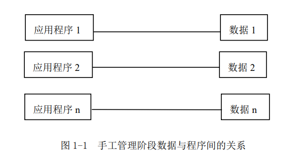
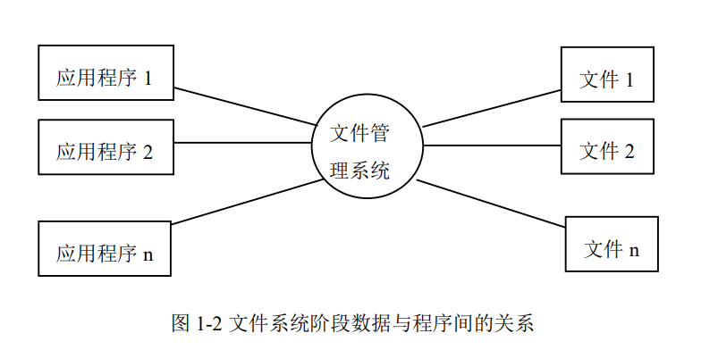
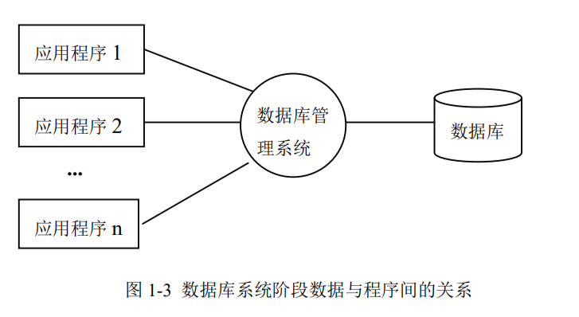
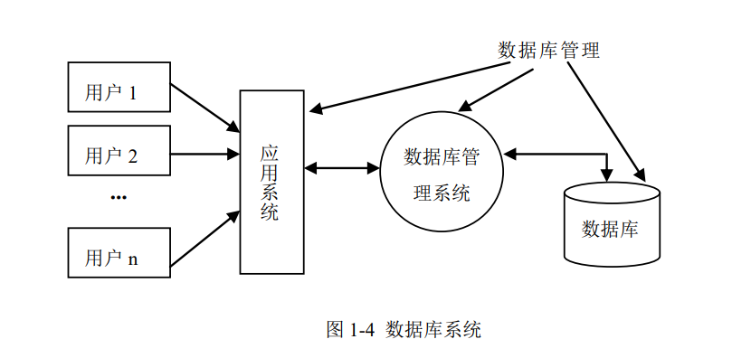

# 1 数据库系统引论

##  1.1 数据管理技术的发展

### 数据

表示信息的符号，例如：数字、文字、图像、声音等

### 数据管理

**对数据进行分类、组织、编码、存储、检索和维护，是数据处理的中心问题**

### 数据管理技术的发展：

#### 人工管理阶段

无直接存取存储设备，数据处理方式是**批处理**，数据处理的特点是：

+ **数据不保存**。数据由应用程序读入内存，数据和程序都不保存在计算机中

+ **没有专用的软件管理数据**。应用程序需要管理数据的逻辑结构和物理结构（如何在计算机中存储和组织数据，为数据分配空间，决定存取方法）

+ **应用程序完全依赖于数据**。应用程序需要管理数据的逻辑结构和物理结构，数据结构的改变、存储和存取方法的变化，都会使应用程序改变。

    > **这种应用程序和数据的存储、存取方式密切相关的情况，称为数据依赖**

+ **数据不能共享**。应用程序与数据一一对应，数据冗余度大

#### 文件系统阶段

由磁盘、磁鼓等直接存取的存储设备，有文件管理系统。数据文件可以按名引用，应用程序通过文件管理系统与多个数据文件发生联系，增加了数据处理的灵活性，数据的物理结构和逻辑结构有了简单变换。数据处理的方式有：**批处理，联机处理**，特点：

> 文件系统的数据从整体上看是无结构的，数据文件之间不存在联系

+ **数据可以长期保存**。存储在磁介质上，可以对数据进行查询、插入、删除和修改等操作

+ **有专门的文件系统软件管理数据**。应用程序不再管理数据的物理存储，程序与数据之间有了一定的物理独立性。

+ **数据是面向应用的**。应用程序和数据之间不再是一一对应的，应用程序可以存取多个文件中的数据。但是数据还是面向应用的，文件之间相互独立，缺少联系。数据的记录结构和应用程序相对应，存在依赖关系。一旦数据结构改变，应用程序也需要进行修改。

+ **数据冗余度大**。数据以文件为单位共享，数据重复存储，冗余度大，带来潜在的数据不一致性。

+ **缺乏对数据统一的控制**。在文件系统中数据的完整性、安全性等完全由应用程序自己管理。

#### 数据库系统阶段

有大容量和快速存取的磁盘，有数据库管理系统，数据处理方式：**联机实时处理、分布处理、批处理**

标志：

+ 1968，IBM 研发了第一个商品化数据库管理系统：**层次数据库系统 IMS**

+ 1969，发布**基于网状模型的 DBTG 报告**

+ 1970，发布“大型共享数据库数据的关系模型”，奠定了关系数据库的理论基础

主要特征：

+ **数据结构化**：**数据整体结构化**是数据库的主要特征之一，数据库系统中数据是相互关联的，不仅表现在记录内部，也表现在记录类型之间的相互联系。数据面向所有数据库的用户，所有数据以一定的形式结构而成，用户可以通过不同的路径存取数据。**数据的最小存取单位是数据项，数据记录可以变长，数据用数据模型描述，无需应用程序定义

+ **数据独立性高**：

    + 物理独立性：数据库物理结构的改变（比如数据的存储格式和组织方法），不影响数据的逻辑结构，不影响应用程序
    
    + 逻辑独立性：数据库中的逻辑数据结构发生改变时（比如增加新应用或某些应用发生变化而需要重新定义数据或数据间联系改变时），其他应用程序无需修改

    > 数据独立性通过**数据库系统所提供的二级映像**实现：**数据的存储结构与逻辑结构之间的映像；数据的全局逻辑结构到应用所涉及的局部逻辑结构之间的映像**

+ **减少数据冗余**：数据库系统下管理的数据是**面向系统**的。**数据集中管理，统一进行组织、定义和存储**

+ **数据共享**：**数据共享**是数据库发展的主要原因，也是重要特征。数据库中数据可以供给多个用户使用，用户数据可以重叠，不同用户在同一时刻可以同时存取数据不受影响。

+ **统一的数据保护功能**：数据库由管理系统统一管理多个用户共享数据资源，系统提供统一的数据安全性、一致性、并发控制和数据库恢复等功能。

    + 数据的安全性（Security）保护：保护数据以防止不合法的使用造成的数据的泄密和破坏
    
    + 数据的完整性（Integrity）检查：保证数据的正确性、有效性和相容性
    
    + 并发（Concurrency）控制：对多用户的并发操作加以控制和协调，防止相互干扰而得到错误的结果

    + 数据库恢复（Recovery）：将数据库从错误状态恢复到某一已知的正确状态

## 1.2 什么是数据库

### 数据库（DB）：

+ **存放数据的仓库**

+ **长期存储在计算机内、有组织的数据集合，根据数据间的联系组织在一起，具有较高的数据独立性，较少数据冗余，数据共享**

+ **存放在介质上相关数据的集合**

### 数据库管理系统（DBMS）

+ **位于用户和操作系统之间的数据管理软件**，能科学地组织和存储数据、高效地获取和维护数据

+ **负责对数据库的管理和维护，具有数据定义、数据操纵、运行管理和维护等功能**

## 1.3 数据模型

+ **模型方法是一种抽象表示**：把事务的主要特征抽象的用一种形式化的描述反映出来简化问题

+ **数据模型就是信息领域中采用的模型方法**

    > 现实世界中的各种事物及其间的联系 ——>数据及数据间的联系

+ **数据模型是数据特征的抽象，用来描述数据的一组概念和定义**。包含 ：

    + **数据结构**：是构造数据库的基本数据结构单位，包含应用所涉及的对象和对象具有的特征，对象间的联系

    > 对数据静态特性的描述

    + **数据操作**：对数据库中对象实例执行的一组操作，检索、插入、删除、修改等
    
    > 对数据的动态特性的描述
        
    + **数据的完整性约束**：对数据静态和动态特性的限定，定义相容的数据库状态的集合及可允许的状态改变

    > 反映了数据间的制约和依存关系

