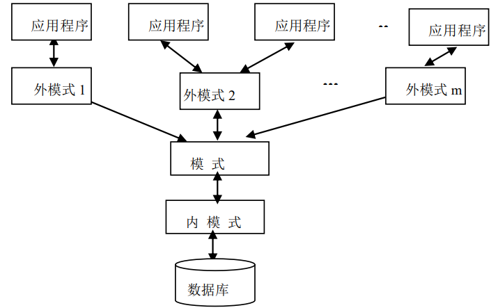

# 1 数据库系统引论

##  1.1 数据管理技术的发展

### 数据

表示信息的符号，例如：数字、文字、图像、声音等

### 数据管理

**对数据进行分类、组织、编码、存储、检索和维护，是数据处理的中心问题**

### 数据管理技术的发展：

#### 人工管理阶段

无直接存取存储设备，数据处理方式是**批处理**，数据处理的特点是：

+ **数据不保存**。数据由应用程序读入内存，数据和程序都不保存在计算机中

+ **没有专用的软件管理数据**。应用程序需要管理数据的逻辑结构和物理结构（如何在计算机中存储和组织数据，为数据分配空间，决定存取方法）

+ **应用程序完全依赖于数据**。应用程序需要管理数据的逻辑结构和物理结构，数据结构的改变、存储和存取方法的变化，都会使应用程序改变。

    > **这种应用程序和数据的存储、存取方式密切相关的情况，称为数据依赖**

+ **数据不能共享**。应用程序与数据一一对应，数据冗余度大

#### 文件系统阶段

由磁盘、磁鼓等直接存取的存储设备，有文件管理系统。数据文件可以按名引用，应用程序通过文件管理系统与多个数据文件发生联系，增加了数据处理的灵活性，数据的物理结构和逻辑结构有了简单变换。数据处理的方式有：**批处理，联机处理**，特点：

> 文件系统的数据从整体上看是无结构的，数据文件之间不存在联系

+ **数据可以长期保存**。存储在磁介质上，可以对数据进行查询、插入、删除和修改等操作

+ **有专门的文件系统软件管理数据**。应用程序不再管理数据的物理存储，程序与数据之间有了一定的物理独立性。

+ **数据是面向应用的**。应用程序和数据之间不再是一一对应的，应用程序可以存取多个文件中的数据。但是数据还是面向应用的，文件之间相互独立，缺少联系。数据的记录结构和应用程序相对应，存在依赖关系。一旦数据结构改变，应用程序也需要进行修改。

+ **数据冗余度大**。数据以文件为单位共享，数据重复存储，冗余度大，带来潜在的数据不一致性。

+ **缺乏对数据统一的控制**。在文件系统中数据的完整性、安全性等完全由应用程序自己管理。

#### 数据库系统阶段

有大容量和快速存取的磁盘，有数据库管理系统，数据处理方式：**联机实时处理、分布处理、批处理**

标志：

+ 1968，IBM 研发了第一个商品化数据库管理系统：**层次数据库系统 IMS**

+ 1969，发布**基于网状模型的 DBTG 报告**

+ 1970，发布“大型共享数据库数据的关系模型”，奠定了关系数据库的理论基础

主要特征：

+ **数据结构化**：**数据整体结构化**是数据库的主要特征之一，数据库系统中数据是相互关联的，不仅表现在记录内部，也表现在记录类型之间的相互联系。数据面向所有数据库的用户，所有数据以一定的形式结构而成，用户可以通过不同的路径存取数据。**数据的最小存取单位是数据项，数据记录可以变长，数据用数据模型描述，无需应用程序定义

+ **数据独立性高**：

    + 物理独立性：数据库物理结构的改变（比如数据的存储格式和组织方法），不影响数据的逻辑结构，不影响应用程序
    
    + 逻辑独立性：数据库中的逻辑数据结构发生改变时（比如增加新应用或某些应用发生变化而需要重新定义数据或数据间联系改变时），其他应用程序无需修改

    > 数据独立性通过**数据库系统所提供的二级映像**实现：**数据的存储结构与逻辑结构之间的映像；数据的全局逻辑结构到应用所涉及的局部逻辑结构之间的映像**

+ **减少数据冗余**：数据库系统下管理的数据是**面向系统**的。**数据集中管理，统一进行组织、定义和存储**

+ **数据共享**：**数据共享**是数据库发展的主要原因，也是重要特征。数据库中数据可以供给多个用户使用，用户数据可以重叠，不同用户在同一时刻可以同时存取数据不受影响。

+ **统一的数据保护功能**：数据库由管理系统统一管理多个用户共享数据资源，系统提供统一的数据安全性、一致性、并发控制和数据库恢复等功能。

    + 数据的安全性（Security）保护：保护数据以防止不合法的使用造成的数据的泄密和破坏
    
    + 数据的完整性（Integrity）检查：保证数据的正确性、有效性和相容性
    
    + 并发（Concurrency）控制：对多用户的并发操作加以控制和协调，防止相互干扰而得到错误的结果

    + 数据库恢复（Recovery）：将数据库从错误状态恢复到某一已知的正确状态

## 1.2 什么是数据库

### 数据库（DB）：

+ **长期存储在计算机内、有组织的数据集合，根据数据间的联系组织在一起，具有较高的数据独立性，较少数据冗余，数据共享**

+ **存放在介质上相关数据的集合**

### 数据库管理系统（DBMS）：统一管理数据库的软件系统

+ **位于用户和操作系统之间的数据管理软件**，能科学地组织和存储数据、高效地获取和维护数据

+ **负责对数据库的管理和维护，具有数据定义、数据操纵、运行管理和维护等功能**

### 数据库系统（DBS）

**对数据提供存储、管理和应用的计算机系统**称为数据库系统

### 数据库管理员 (DBA)

**负责整个数据库系统建立、维护和协调工作的专门人员**

## 1.3 数据模型

+ **模型方法是一种抽象表示**：把事务的主要特征抽象的用一种形式化的描述反映出来简化问题

### 概念数据模型/信息模型

独立于计算机之外，用来描述某一特定范围内人们所关心的信息结构，是面向用户的。只要用户需求补办，概念模型也不变

### 数据模型

面向计算机的，按照计算机系统的观点对数据进行建模。传统的数据模型有：**层次模型，网状模型，关系模型**

+ **数据模型就是信息领域中采用的模型方法**

    > 现实世界中的各种事物及其间的联系 ——>数据及数据间的联系

+ **数据模型是数据特征的抽象，用来描述数据的一组概念和定义**。包含 ：

    > 物理数据模型是对数据最低层次的抽象

    + **数据结构**：是构造数据库的基本数据结构单位，包含应用所涉及的对象和对象具有的特征，对象间的联系

    > 对数据静态特性的描述

    + **数据操作**：对数据库中对象实例执行的一组操作，检索、插入、删除、修改等
    
    > 对数据的动态特性的描述
        
    + **数据的完整性约束**：对数据静态和动态特性的限定，定义相容的数据库状态的集合及可允许的状态改变

    > 反映了数据间的制约和依存关系

+ **数据模型的结构**表示了应用所涉及的对象和对象之间的联系，**是区别数据模型最主要的部分**，因此一般所指的不同数据模型主要有数据结构来表征。

+ 数据模型的两个层次：

    + 逻辑数据模型：用户看到的数据模型，仅表示数据的逻辑结构（作为 DBMS 分类标准）；用户在此层级上操作数据库

    + 物理数据模型：存储在设备介质上所对应的数据模型，表示数据存储结构和存取方法，反映逻辑数据模型在物理存储器上的具体实现，与 DBMS 、操作系统和硬件有关

## 1.4 数据库系统结构

在数据库系统中，用户可以逻辑地、抽象地处理数据，而不必考虑数据在计算机中是如何进行组织、存放的。

### 最终用户结构

+ 单用户结构

+ 主从式结构

+ 分布式结构

+ 客户-服务器

+ 浏览器-应用服务器／数据库服务器多层结构等

### 三级模式结构

#### 外模式/子模式（视图级）

> 保障数据库安全性，用户只能看见和访问对应外模式中的数据

+ **数据库用户的数据视图，体现了用户的数据观点，是对用户数据的逻辑描述，局部数据的逻辑结构和特征**

+ **外模式是模式的子集，一个模式可以对应多个外模式，外模式之间可以相互覆盖**，**外模式对于数据的描述**包括数据结构、类型、长度等都**可以和模式不同**

    > 外模式由外模式描述语言(SDDL)定义，根据不同的编程语言，一个 DBMS 可以提供不同的外模式买哦书语言

+ **应用程序根据外模式中对数据的描述存取数据**，**一个应用只能使用一个外模式**，但是外模式可以被共享

#### 模式/概念模式/逻辑模式（概念级）

> 所有用户的**公共数据视图**

+ 是数据库总的框架，是**对数据库中全体数据的逻辑结构和特性的描述**，**独立于应用程序和物理存储**

+ **一个数据库对应一个模式**，所有数据的都是按照模式进行装配的

+ 模式由**模式描述语言(DDL)**描述，是对所有记录类型和数据项类型及其联系的描述

#### 内模式/存储模式（物理级）

> 数据在数据库内的表示方法

+ 对数据库存储结构和存取方法的描述，规定了数据在存储介质上的物理组织方法、记录寻址方式，定义物理存储块的大小、溢出处理方法等。

+ 一个模式对应一个内模式，一个数据库对应一个内模式

+ 内模式由**数据存储描述语言(DSDL)**描述，也叫内模式描述语言(内模式DDL)

#### 总结

+ 内模式是整个数据库实际存储的表示

+ 概念模式是整个数据库实际存储的抽象表示

+ 外模式是概念模式的某一部分的抽象表示

### 三级模式结构的二级映像

**实现了数据库系统的数据独立性**

#### 外模式和模式之间的映像

定义局部数据逻辑结构与全局逻辑结构之间的对应关系

**数据的逻辑独立性**：模式结构改变，只需要修改外模式和模式间的对应关系，不必修改外模式中的局部逻辑结构，相应的应用程序不变

#### 模式和内模式之间的映像

定义全局数据逻辑结构和物理数据存储间的对应关系

**数据的物理独立性**：数据库物理存储结构改变时，只需要修改模式和内模式的对应关系，不必修改模式中的全局逻辑结构，相应的应用程序不变

## 1.5 数据库管理系统

### 数据库管理系统的功能

#### 数据库的定义功能

DBMS 提供**数据定义语言**定义数据库的数据结构。用数据定义语言描述的模式称为**源模式**，源模式由模式翻译程序翻译成机器代码表示的形式，称为**目标模式**。目标模式保存在数据字典中，DBMS 将参照它们决定存取路径，执行对数据的操作。

+ DDL：定义数据库的全局逻辑结构

    + 定义记录型和记录的数据项，包括记录和数据项的命名，记录的键，数据项的数据类型、长度；

    + 说明数据之间的联系；

    + 定义对数据进行有效性检查的约束条件；

    + 规定数据的安全控制等

+ 外模式DDL：定义用户的局部逻辑结构

+ 内模式DDL：定义物理数据库的结构

    + 物理数据库是在设备介质上真正存在的数据库

    + 数据的存储方式, 如直接存储、索引组织或链式结构

    + 数据的存取方式和检索技术, 如索引方式用索引寻址法，对直接文件用散列法等

    + 对数据的分区、分页,如规定数据区、索引区

#### 数据库的操纵功能

DBMS 提供数据操纵语言(DML)实现对数据库的操作，对数据库的基本操作包括检索和更新两大类，数据更新包括对数据库的插入、删除和修改操作。、

DML 分为**自含型 DML** 和**宿主型 DML**：

+ **自含型 DML**：可以交互使用，具有单独的编译或解释程序，主要用于查询。（通常称为查询语言）——面向问题

+ **宿主型 DML**：不能单独执行，必须嵌入 C 语言等高级语言中使用，是应用程序和数据库管理程序之间的接口，主要实现对数据库的读写操作，主语言完成对数据处理过程的控制、数据的输入/输出功能。（对主语言的扩充）

#### 数据库的保护功能

包括对**数据库安全性、完整性控制、并发控制和数据库恢复功能**。

+ **安全性控制**：主要是**防止未授权用户对数据库的操作**所造成数据的泄露、更改和破坏

+ **完整性控制**：**保证数据库数据的正确性和相容性，以防止对数据库的误操作**。通过**完整性约束**实现

+ **并发控制**：解决**多用户共享数据库时不会出现读写数据库的错误**

+ **恢复功能**：提供数据遭到破坏时将数据库**恢复到正确状态**的功能，保证数据库的一致性

#### 数据库的维护功能

一般 DBMS 提供实用例程供数据库管理员定期对数据库进行维护

+ **转储程序**：防止数据库出现出现故障时破坏数据，用转储程序将数据库转储到磁带上备份

+ **数据装入程序**：用于将大量数据转化为数据库的存储格式存储到数据库中，或者将备份数据装入数据库中

+ **统计分析程序**：将程序运行期间的统计资料加以分析整理，以决定是否需要重组数据库

+ **重组程序**：重新组织数据库，包括文件组织方式的改变，数据的重新装配等

+ 此外，还包括对**无用数据的收集及空间的再分配**等程序

### 数据库管理系统的组成

+ 系统主控程序
+ 存取控制程序
+ 并发控制程序
+ 数据有效性检查程序
+ 数据保护程序
+ 查询处理程序
+ 数据更新程序
+ 目录管理程序
+ 通讯程序

### 数据库管理系统的工作过程

+ 应用程序通过 DML 命令向 DBMS 发读请求，并提供读取记录参数。
+ DBMS 根据应用程序对应的外模式中的信息，检查用户权限、决定是否接受应
用程序的读请求。
+ 如果是合法用户，则查看模式，根据模式与外模式间数据的对应关系，确定需要
读取的逻辑数据记录。
+ DBMS 查看内模式，根据模式与内模式间的映像关系确定需要读取哪些物理记录。
+ 向操作系统发读取记录的命令。
+ 操作系统执行该命令，控制存储设备从数据库中读取物理记录数据。
+ 在操作系统控制下将读出的记录送入系统缓冲区，并通知 DBMS 数据已读出。
+ DBMS 比较模式和外模式，从系统缓冲区中得到所需的逻辑记录，经过必要的数据变换后，将数据送入用户工作区。
+ DBMS 设置通信单元以向应用程序发送读命令执行情况的状态信息。
+ 应用程序根据状态信息确定 DML 命令执行是否成功，若成功则对工作区中读出的数据进行相应处理，否则出错处理。

### 数据库管理员的主要职责

+ 决定数据库的信息内容
+ 决定数据库的存储结构和存取策略
+ 定义存取权限和有效性检查
+ 建立数据库
+ 监督数据库的运行
+ 重组和改进数据库