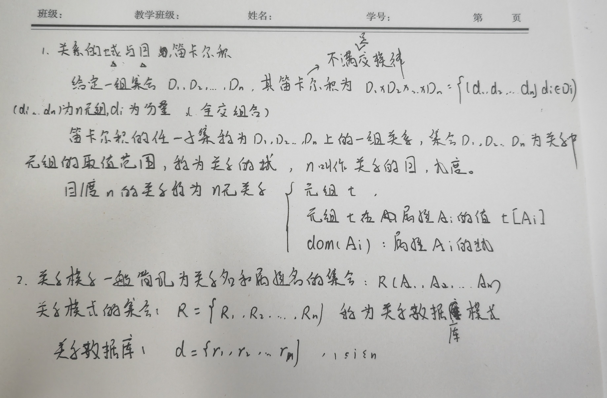
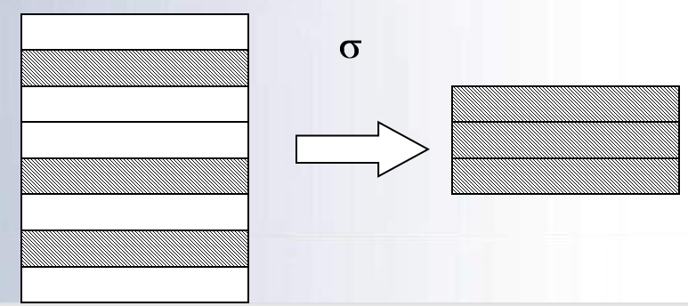
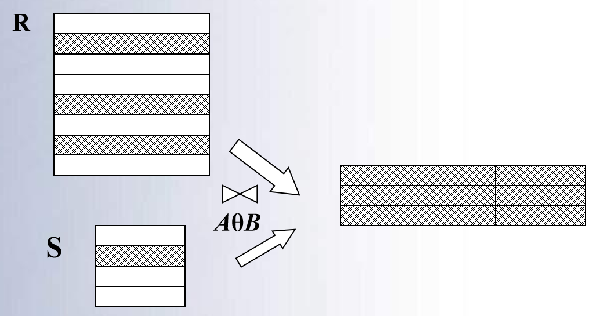

# 关系数据库

关系数据模型是目前最重要的一种数据模型，它的三个要素是**关系数据模型、关系操作、关系完整性约束**

> 如果采用关系数据库实现应用，在数据库逻辑设计阶段需将**概念模型**转换为关系数据模型。

## 关系模型的基本概念

**严格地说，关系是一种规范化了的二维表中行的集合**

**无限关系在数据库中是无意义的，因此限定关系代数数据模型中的关系必须是有限集合**

关系数据库中，关系都是规范化的，具有如下性质：

+ 每一列中的值是同类型的数据，来自同一个域。
+ 不同的列可以有相同的域，每一列称为属性，用属性名标识。
+ 列的次序是无关紧要的。
+ 元组的每个分量是无序的,原子的，是不可分的数据项。
+ 元组的次序是无关紧要的。
+ 各个元组是不同的，即关系中不允许出现重复元组。

### 键

**能够唯一标识元组的属性或属性组**

+ 关系中能够起标识作用的键称为候选键
+ 在一个关系中，如果有多个候选键，选其中的一个键作为主键(primary key) 
+ 若关系的键由多个属性组成，称为联合键
+ 关系的所有属性构成该关系的键，称为全键

### 完整性约束

为了维护数据库中数据与现实世界的一致性，对关系数据库的插入、删除和修改操作必须有一定的约束条件，这就是关系模型的三类完整性：

> 实体完整性和参照完整性是关系的两个不变性，是关系模型中最基本的约束, 应该由关系系统自动支持

#### 实体完整性

对主键取值的约束, 作为主键组成的部分不能为空

#### 参照完整性

对关系中作为外键的值的约束

#### 用户自定义完整性

用户根据实际应用定义的完整性约束

## 关系代数

把关系作为集合,对其进行各种集合运算和特殊的关系运算

### 传统的集合运算

> **要求参与运算的两个关系具有相同的目且对应属性定义在同一个域上**

并、差、交、广义笛卡尔积

把关系看成元组的集合，以元组作为集合中元素来进行运算，其运算是从关系的“水平”方向即行的角度进行的

### 专门的关系运算

选择、投影、连接、除

不仅涉及行运算，也涉及列运算，这种运算是为数据库的应用而引进的特殊运算。

#### 选择

> 选择满足条件的行

从关系中选择满足一定条件的元组子集, 返回的是满足条件的元组集合

$$
    \sigma_F(R)=\{t|t\in R~\wedge~t(F)\}
$$

F 是限定条件的布尔表达式，由逻辑算符 $$(\neg ,\vee ,\wedge )$$ 连接比较表达式组成

#### 投影

> 选择选定属性的列

$$
    \Pi_x(R)=\{t[X]|t\in R\}
$$

需要注意, **投影之后不仅取消了原关系中的某些列，而且还可能取消某些元组（避免重复行）**

#### 连接

> 把二个关系中的元组按条件连接起来，形成一个新关系

$$
\mathop{R\Join S}_{A~\theta ~B} = \sigma_{A~\theta ~B}(R \times S)
$$

+ 条件连接, 也叫θ连接

+ 自然连接: 在两个关系共同属性上的等值连接

> 一般情况下，当对关系R和S使用自然连接时，要求R和S含有一个或多个共有的**属性**

#### 除法

> 选择包含除数的行但是需要去除除数的属性列

$$R \div S = \Pi_X(R) - \Pi_X(\Pi_X(R)\Join S - R)$$ 

#### 左外连接

包含左边关系中不符合连接条件的元组, 其右关系中元组为空值

## 关系演算

用谓词表示查询要求和条件

### 元组关系演算

+ 谓词变元的基本对象是元组变量
+ 典型代表：APLHA, QUEL

### 域关系演算

+ 谓词变元的基本对象是域变量
+ 典型代表：QBE

## 关系数据语言的分类

### 关系数据语言

+ 关系代数语言
+ 关系演算语言
    + 元组关系演算语言
    + 域关系演算语言
+ 具有关系代数和关系演算双重特点的语言（SQL）

### 关系数据语言的特点

+ 是一种高度非过程化的语言
+ 存取路径的选择由DBMS的优化机制来完成
+ 用户不必用循环结构就可以完成数据操作
+ 能够嵌入高级语言中使用
+ 关系代数、元组关系演算和域关系演算三种语言在表达能力上完全等价

## 关系运算的安全限制和三种关系运算的等价性

### 安全限制

+ 关系是集合论中的概念，在集合论中，关系可以是无限的。

+ 在关系数据库中，关系被限定为是有限的, 不产生无限关系的关系表达式称为安全运算表达式, 所采取的措施称安全限制

+ 关系代数运算是安全的，只要参加运算的关系是有限的，关系运算的结果关系也是有限的。关系运算的有限次复合不会出现无限关系

+ 关系演算不一定是安全的，需要加以限制

### 三种关系运算的等价性

在加以安全限制后，这三种关系运算在表达关系的功能上是等价的。

