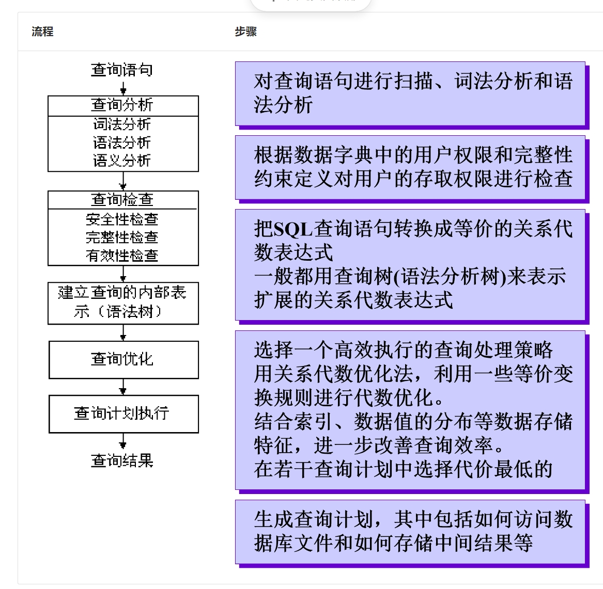
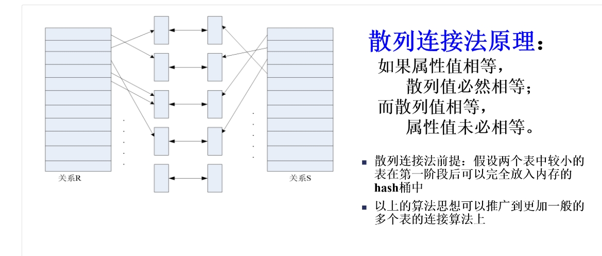

# 5 查询处理和查询优化

## 5.1 关系数据库系统的查询处理

### 查询处理过程

1. 查询分析
2. 查询检查
3. 建立查询的内部表示
4. 查询优化
5. 查询执行

数据库查询语的具体处理过程可以分为：

+ 解释方式:DBMS不保留可执行代码，每一次都重新解释执行查询语句，事务完成后返回查询结果。
    > 这种方法具有灵活、应变性强的特点，但是开销比较大、效率比较低，主要适用于不重复使用的偶然查询

+ 编译方式: 先进行编译处理，生成可执行代码。运行时，直接执行可执行代码,当数据库中某些数据发生改变，再重新编译。
    > 编译的方法主要优点是执行效率高、系统开销小

### 执行查询操作的基本算法

#### 选择操作的实现

+ 顺序扫描方法

    > 实现选择操作最简单的一种方法

    按照**关系中元组的物理顺序**扫描每个元组，检查该元组是否满足选择条件，如果满足则输出

    这种方法不需要特殊的存取路径，简单、有效，适用于任何关系，**尤其适用于被选中的元组数占有较大比例或元组数较少的关系**

    代价估算如下：
    + 如果关系R的元组占用的块数（块是数据在磁盘和内存之间传递的单位）为 $B_R$，顺序扫描方法的代价 $cost=B_R$
    + 如果选择条件是**主键上的相等比较**操作，那么平均搜索一半的文件块才能找到满足条件的元组，因此平均搜索代价 $cost=B_R/2$

+ 二分查找法

    > 如果选择条件涉及**相等比较**，并且**物理文件是按照选择字段有序组织**的，可以使用二分查找来定位

    代价估算如下：
    + 二分查找法是针对文件的物理块进行的，平均搜索代价为$\left \lceil log_2B_R \right \rceil$
    + 如果选择是作用在非排序属性上，那么将会有多个块包含所需的元组，代价也会相应增加

+ 使用索引（或散列）的扫描方法

    > 适合选择条件中的属性上有索引(例如B+树索引或Hash索引)

    通过索引先找到满足条件的元组指针，然后通过该指针继续检索满足查询条件的元组

    索引扫描算法的代价估算公式：
    + 如果选择条件是相等比较操作，需要存取索引树中从根结点到叶结点L块，再加上基本表中该元组所在的那一块，所以cost=L+1
    + 如果选择条件涉及非主键属性的相等比较，若为B+树索引，如果有S个元组满足条件，若每个满足条件的元组可能会保存在不同块上，最坏情况下cost=L+S。
    + 如果比较条件是＞，＞＝，＜，＜＝操作，而且假设有一半的元组满足条件就要存取一半的叶结点，则代价估计cost=L+索引的叶结点数/2+元组占用的块数 /2

#### 连接操作的实现

连接操作是查询处理中最耗时的操作之一，操作本身开销大，并且可能产生很大的中间结果

+ 嵌套循环法

    > 一般使用较少块的文件作为外循环文件连接代价较小, 笛卡尔积的实现通常采用**嵌套循环法**

    嵌套循环法适用于任何条件的连接

+ 索引嵌套循环法

    >在嵌套循环法中，如果两个连接属性中的一个属性上存在索引（或散列）

    可以通过S的索引查找满足满足条件的所有元组而不必扫描S中的所有元组，减少扫描时间。

+ 排序合并法

    > 适合连接的诸表已经排好序的情况,可用于自然连接和等值连接

    步骤:
    1. 如果连接的表没有排好序，先对表按连接属性排序
    2. 取S表中第一个连接属性，依次扫描R表中具有相同连接属性的元组，当扫描到连接属性不相同的第一个R元组时，返回S表扫描它的下一个元组
    3. 再扫描R表中具有相同连接属性的元组，把它们连接起来
    4. 重复上述步骤直到S表扫描完

    **S表和R表都只要扫描一遍**
    
+ 散列连接法

    > 散列连接法前提：假设两个表中较小的表在第一阶段后可以完全放入内存的hash桶中

    把连接属性作为hash码，用同一个hash函数把R和S中的元组散列到同一个hash文件中

    步骤:
    1. 划分阶段(partitioning phase)：对包含较少元组的表(比如R)进行一遍处理, 把它的元组按hash函数分散到hash表的桶中
    2. 试探阶段(probing phase)：也称为连接阶段(join phase), 对另一个表(S)进行一遍处理, 把S的元组散列到适当的hash桶中, 把元组与桶中所有来自R并与之相匹配的元组连接起来

    

## 5.2 关系数据库系统的查询优化

查询优化的总目标：选择有效策略，求得给定关系表达式的值，使查询代价最小(实际上是较小)

根据查询优化的层次不同, 查询优化技术分为:

### 代数优化

是关系代数表达式的优化, 按照一定的规则，改变代数表达式中操作的次序和组合，使查询执行更高效。

只改变查询语句中操作的**次序和组合**，不涉及底层的存取路径, 也称为规则优化, 只对关系代数表达式解析等价变化

### 基于存取路径的优化

合理选择各种操作的存取路径以获得优化效果; 需要考虑**数据的物理组织和访问路径**，以及**底层操作算法**的选择，涉及数据文件的组织方法、数据值的分布情况等，也称为物理优化

### 基于代价估算的优化

对于多个可选的查询策略, 通过估算执行策略的代价, 从中选择代价最小的作为执行策略.由于需要计算操作执行的代价, 开销大

## 代数优化

