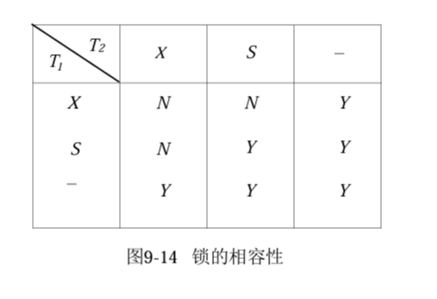

## 基于封锁的并发控制技术

其基本思想是：当事务 T 要修改记录 A, 如果修改 A 之前先给 A 加锁，使得 T2 和其它事务不能读取和修改 A, 直到 T 修改并写回 A 后解除对 A 的封锁为止。这样，既不会丢失事务 T 的更新，也不会出现读“脏”数据的问题。

### 锁

所谓封锁就是事务先对数据加锁后再对其执行操作。事务 T 加锁后就对该数据有了控制，而其它事务在事务 T 对该数据对象解除封锁之前，不能修改此数据对象。因此，**锁是数据项上的并发控制标志**。给数据加锁的方式有多种，基本的锁类型有两种：

+ #### 共享锁 ( Share Locks, 又称 S 锁 )

    > 又叫读锁

    如果事务 T 对数据 A 加上了 S 锁，则事务 T 可以读数据 A，不能写 A。

+ #### 排他锁 ( Exclusive Locks, 又称 X 锁 )

    > 又叫写锁

    如果事务 T 对数据 A 加上了 X 锁，则事务 T 可以读写数据 A。

在基于封锁的并发控制中要求每个事务都要根据对数据 A 的操作需求申请相应类型的锁。该请求发送给事务管理器，只有获得所需锁后，事务才能继续其操作。

是否能够获得锁是由锁的相容性决定的。当事务 T 对数据 A 加上共享锁后，其它事务只能再对 A 加共享锁，而不能加排它锁，直到 T 释放 A 上的共享锁。这可以保证在 T 释放 A 上的共享锁之前，事务 T 所读到的 A 的值是正确的。当事务 T 对数据 A 加上了排它锁后，其他任何事务都不能对 A 加上任何类型的锁，直到 T 释放 A 上的排它锁。这样，可以保证 T 释放 A 上的排它锁之前，其他事务都不能读写事务 T 所操作的数据 A。

锁的相容性：

锁的正确使用要保证：

+ 事务的一致性：事务只有已经申请了锁并且还没有释放锁时，才能读写该数据项；如果事务封锁某个数据项，它必须为该数据项解锁。

+ 调度的合法性：任何两个事务都不能使用不相容的锁封锁同一个数据项，除非一个事务已经为该数据项解锁。

### 封锁协议

在给数据对象加锁时，要考虑何时请求锁、持有锁的时间和何时释放等，要遵从一定规则。这些规则被称为封锁协议 ( Locking Protocol )。

1. 一级封锁协议

    事务 T 在修改数据 A 前必须先对其加 X 锁，直到**事务结束才释放**，可防止丢失更新，并保证事务 T 是可恢复的。

2. 二级封锁协议

    > 一级封锁协议解决了数据更新丢失的问题，但是无法解决脏读问题。

    在一级封锁协议的基础上，事务 T 在读取数据 A 之前不许先对其加 S 锁，**读取完毕后再释放**，可防止脏读。

3. 三级封锁协议

    > 二级封锁协议解决了脏读问题，但是无法解决不可重复读问题。因为第一次读和再读之间没有 S 锁保障。

    在二级封锁协议的基础上，某一事务添加的 S 锁需要保持到**事务结束才释放**。

#### 活锁

#### 死锁

